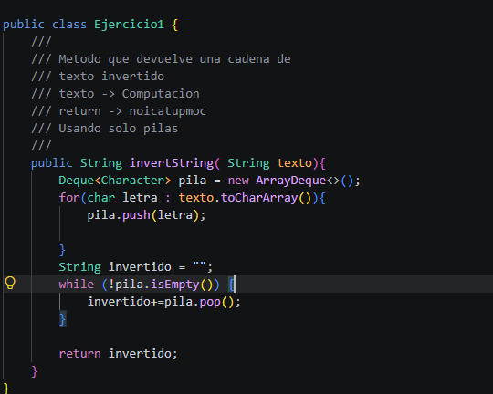
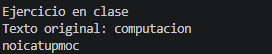
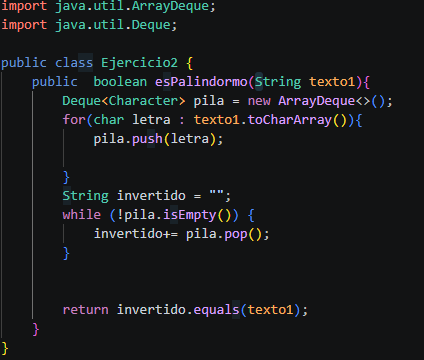
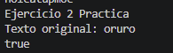

# Práctica: Estrucutras Dinamicas Lineales

## Datos del Estudiante
- **Nombre:**  Cristopher Carangui
- **Curso:** Estructura de Datos

---

## 1. Implementación de estructuras dinamicas Lineales

**Fecha:** 08/06/2026
## Descripción:
En esta seccion de implemmentaran las siguientes estrcuturas dinamicas lineales
    -Listas enlazadas con LinkedList
    - Pilas con Queue y Stack
    -Colas con  Queue
## Ejercicio 1

## Salida en Consola

## 2. Ejercicio Palindromo

**Fecha:** 10/06/2026
##Descripcion:
En esta practica se realizo un ejercio de ver si una palabra es palindromo y que imprimia en consola si es palindromo true sino false en la variable de texto1 se implementa el toLowerCase() para que el texto se obtenga en minuscula el texto para verificar.
## Ejercicio 2

## Salida en Consola

