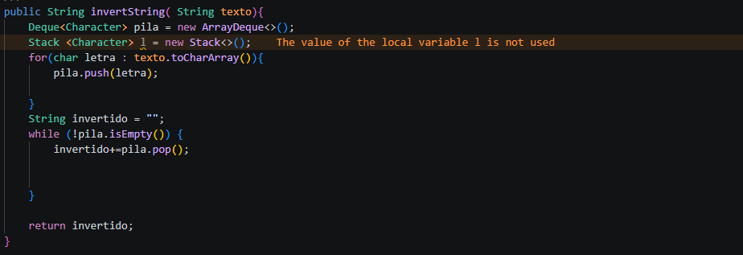

# Práctica: Estrucutras Dinamicas Lineales

## Datos del Estudiante
- **Nombre:**  Cristopher Carangui
- **Curso:** Estructura de Datos

---

## 1. Implementación de estrcuturas dinamicas Lineales

**Fecha:** 08/06/2026
## Descripción:
En esta seccion de implemmentaran las siguientes estrcuturas dinamicas lineales
    -Listas enlazadas con LinkedList
    - Pilas con Queue y Stack
    -Colas con  Queue
## Ejercicio 1

